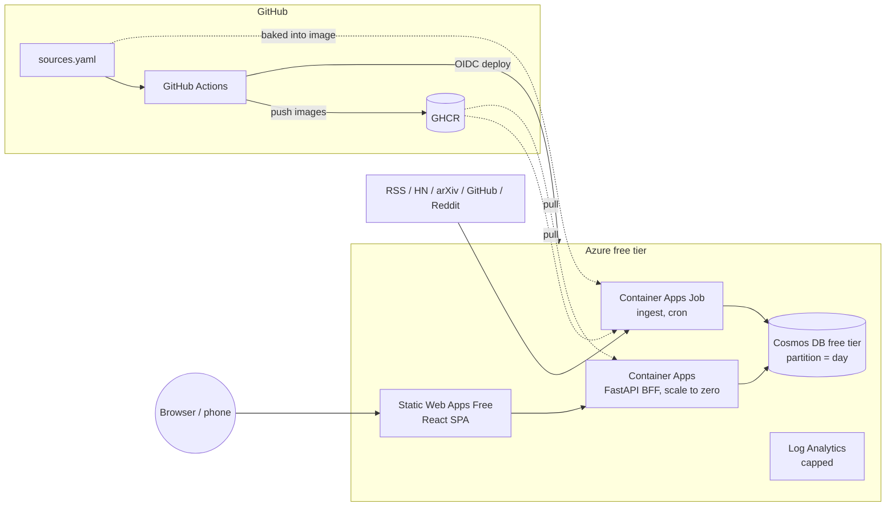

# AI Daily Digest

A consolidated daily feed of AI news with links to articles, built as an end-to-end tech demo on Azure using **only always-free services** and developed with Claude Code from desktop and mobile.

Sources (RSS feeds, Hacker News, arXiv cs.AI/cs.CL, GitHub trending, Reddit) are declared in [`sources.yaml`](sources.yaml). Adding one is a tiny PR that CI deploys. v1 has no LLM summaries: items are ranked by source weight, recency and score.

## Status

**Scaffolding and plans only. No product code yet.** See [`docs/plans/`](docs/plans/README.md).

| Phase | Plan | Status |
|---|---|---|
| 00 | [Overview & architecture](docs/plans/00-overview-architecture.md) | Drafted |
| 01 | [Repo & CI skeleton](docs/plans/01-repo-ci-skeleton.md) | Not started |
| 02 | [Azure bootstrap](docs/plans/02-azure-bootstrap.md) | Not started |
| 03 | [Ingest job](docs/plans/03-ingest-job.md) | Not started |
| 04 | [BFF API](docs/plans/04-bff-api.md) | Not started |
| 05 | [React front end](docs/plans/05-react-frontend.md) | Not started |
| 06 | [Deployment pipeline](docs/plans/06-deployment-pipeline.md) | Not started |
| 07 | [Mobile-workflow experiments](docs/plans/07-mobile-workflow-experiments.md) | Not started |
| 08 | [Later options](docs/plans/08-later-options.md) | Not started |

## Architecture



## Hosting (all always-free)

| Component | Service |
|---|---|
| Front end | Azure Static Web Apps (Free) |
| API | Azure Container Apps, consumption plan, min replicas 0 |
| Ingest | Azure Container Apps Job (cron) |
| Data | Azure Cosmos DB free tier (1000 RU/s, 25 GB), partitioned by day |
| Images | GitHub Container Registry (Azure Container Registry is not free) |
| Logs | Log Analytics, within the 5 GB/month allowance, with a daily cap |
| CI/CD | GitHub Actions with OIDC federated credentials |

Details, limits and uncertain points: [plan 00](docs/plans/00-overview-architecture.md).

## Repo layout

```
api/        FastAPI BFF
ingest/     scheduled ingest job
web/        React + Vite + TypeScript + MUI
infra/      Bicep
docs/plans/ build plans
sources.yaml
CLAUDE.md   guidance for Claude Code (including mobile)
```

## Contributing from your phone

Small PRs, preferably editing `sources.yaml` or UI config. See [`CLAUDE.md`](CLAUDE.md) and [plan 07](docs/plans/07-mobile-workflow-experiments.md).
